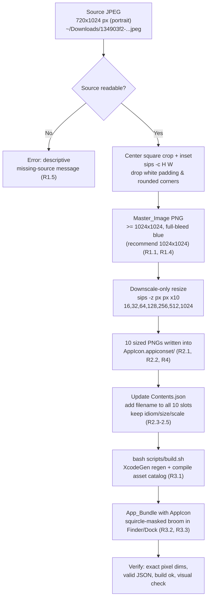

# Design Document

## Overview

CleanMac currently ships with an `AppIcon.appiconset` that declares all ten
standard macOS icon slots but references no PNG files, so Finder and the Dock
render a blank/placeholder icon. This feature replaces the missing icon with the
user-provided broom logo.

The work is an **image-preparation + asset-wiring pipeline**, not application
logic. Nothing in the Swift code, `project.yml`, or build configuration changes.
The pipeline takes the source JPEG, crops it to a full-bleed square master,
downscales that master into the ten required PNG sizes, drops those PNGs into
`AppIcon.appiconset`, and adds `filename` keys to the ten slots in
`Contents.json`. All tooling is native to macOS (`sips`, `iconutil`,
`qlmanage`) — no Homebrew, ImageMagick, or third-party dependency is introduced.

### Verified Facts (design basis)

- **Source image:** `~/Downloads/134903f2-e132-41cd-a54d-5fb03236241c.jpeg`,
  **720×1024 px** (portrait). The blue rounded-square broom artwork is centered
  horizontally, spans ~the full 720 px width, with white padding above and below.
  A horizontal-full, vertically-centered **720×720** crop captures the artwork.
- **Asset catalog:** `CleanMac/Resources/Assets.xcassets/AppIcon.appiconset/Contents.json`
  declares 10 `mac` slots (16, 32, 128, 256, 512 at `@1x` and `@2x`) with **no
  `filename` keys** today.
- **Build:** `bash scripts/build.sh`. The `.xcodeproj` is generated by XcodeGen
  and is gitignored. `project.yml` sets `ASSETCATALOG_COMPILER_APPICON_NAME: AppIcon`.
- Because the `.xcodeproj` is regenerated on build, **changing only the asset
  files requires no `project.yml` edit** — a normal `bash scripts/build.sh`
  regenerates the project and recompiles the asset catalog.

### Goals

- Produce a 1:1 square Master_Image ≥ 1024 px with the blue artwork full-bleed
  and no white padding.
- Generate all ten required PNG pixel sizes by **downscaling only** from the master.
- Wire every slot in `Contents.json` to a real PNG via a `filename` key, keeping
  `idiom`/`size`/`scale` untouched and the JSON valid.
- Build cleanly and render the broom icon in Finder/Dock.
- Provide a small, dependency-free, idempotent helper script so the icon can be
  regenerated if the logo changes.

### Non-Goals

- **No Swift source changes.** (R5.2)
- **No `project.yml` changes.** `ASSETCATALOG_COMPILER_APPICON_NAME` stays
  `AppIcon`. (R3.4, R5.3)
- **No DMG re-packaging / GitHub release.** R6 is optional and out of scope for
  this design's implementation; it is described only as a follow-on path.
- No new runtime dependencies, no ImageMagick / create-dmg / brew tooling.

## Architecture

The pipeline is a single-direction transform from one source JPEG to ten PNGs
plus an updated manifest.



The two stages map directly to the glossary roles:

- **Icon_Preparer** = the crop step (A→D). Owns square-ness, padding removal,
  corner handling, and the ≥1024 px master. (R1)
- **Icon_Generator** = the resize + wiring step (D→H). Owns the ten exact-size
  PNGs and the `Contents.json` filename mapping. (R2, R4)

## Components and Interfaces

### Component 1: Icon_Preparer (crop to square master)

**Responsibility:** Convert the 720×1024 portrait JPEG into a full-bleed square
PNG master of at least 1024 px, with the surrounding white removed and the
artwork's own rounded corners shaved so macOS is the *only* thing that rounds
corners.

**Inputs:** source JPEG path.
**Output:** `Master_Image` PNG (recommended 1024×1024).

**Key interface (sips):**

- Center square crop: `sips -c <height> <width> <in> --out <out>` — `sips -c`
  takes **height then width** and crops centered on the image. For the 720×1024
  source, `sips -c 720 720` yields the 720×720 center square (drops the top/bottom
  white bands: `(1024-720)/2 = 152 px` trimmed off each end).
- Optional inset to shave the baked-in rounded corners (see decision below):
  crop to a square slightly smaller than 720 centered on the blue, e.g.
  `sips -c 680 680` (≈20 px inset per side) up to `sips -c 640 640` (≈40 px).
- Upscale the cropped square to the 1024 master and force PNG:
  `sips -z 1024 1024 -s format png <cropped> --out master.png`.
  (This single controlled upscale to the master is acceptable because every
  *delivered* icon size then downscales from it — R4.2 forbids upscaling to
  produce delivered sizes, and the largest delivered size is 1024.)

### Component 2: Icon_Generator (sized PNGs + manifest)

**Responsibility:** From the master, emit the ten exact-pixel PNGs into
`AppIcon.appiconset` and set the `filename` for each of the ten slots.

**Inputs:** `Master_Image` PNG, target `AppIcon.appiconset` dir.
**Outputs:** ten PNG files + updated `Contents.json`.

**Key interface (sips):** for each unique pixel size `px` in
{16, 32, 64, 128, 256, 512, 1024}: `sips -z <px> <px> master.png --out AppIcon.appiconset/<name>.png`. `sips -z` sets height then width to exact pixel dimensions, guaranteeing a 1:1
result at the declared size (R4.1, R4.3).

### Component 3: Helper script (`scripts/make-appicon.sh`)

**Responsibility:** Orchestrate Icon_Preparer + Icon_Generator in one
idempotent, dependency-free run so the icon set can be regenerated whenever the
source logo changes. This is **additive tooling** — a shell script under
`scripts/`, not a Swift change and not a `project.yml` change — so it does not
violate R5 (R5 constrains what the *icon change* touches; adding a build helper
script is separate repo tooling and does not alter app behavior or existing
assets beyond the intended `AppIcon.appiconset` files).

**Interface:**

```
bash scripts/make-appicon.sh [<source-image>]
```

- `<source-image>` — optional; defaults to
  `~/Downloads/134903f2-e132-41cd-a54d-5fb03236241c.jpeg`.
- Writes the 10 PNGs and (optionally) rewrites `Contents.json` filenames into
  `CleanMac/Resources/Assets.xcassets/AppIcon.appiconset/`.
- Idempotent: re-running overwrites the master + the 10 PNGs deterministically;
  output is the same given the same source.

**Sketch of the key invocations (design-level, not final code):**

```bash
SRC="${1:-$HOME/Downloads/134903f2-e132-41cd-a54d-5fb03236241c.jpeg}"
SET="CleanMac/Resources/Assets.xcassets/AppIcon.appiconset"
[ -f "$SRC" ] || { echo "error: source image not found: $SRC" >&2; exit 1; }

# 1. Master: center square crop (inset to shave baked corners) -> 1024 PNG master
TMP="$(mktemp -d)"
sips -c 680 680 "$SRC" --out "$TMP/sq.png"                 # center square, ~20px inset
sips -z 1024 1024 -s format png "$TMP/sq.png" --out "$TMP/master.png"

# 2. Ten sizes -> straight into the appiconset (downscale from master)
for px in 16 32 64 128 256 512 1024; do
  sips -z "$px" "$px" "$TMP/master.png" --out "$SET/icon_${px}.png"
done
```

**Commit policy:** the generated PNGs **are committed** to the repo. Asset PNGs
are ordinary source-controlled build inputs (Xcode compiles them into
`Assets.car` at build time), unlike the `.xcodeproj` which is a *generated*
artifact and is gitignored. The 1024 master and any temp files are intermediate
and need not be committed (recommend using `mktemp` scratch as above).

## Corner-Handling Decision (key design call)

The source artwork *already* has rounded-square corners baked into its blue
background, and **macOS always applies its own squircle mask** to app icons at
render time. If we hand macOS an already-rounded square, it rounds a second time.

### Option A — full-bleed square of blue; let macOS do the only rounding (RECOMMENDED)

Crop **just inside** the blue so the artwork's own rounded corners are cropped
off, producing a full-bleed square that is solid blue all the way to every edge
and corner. macOS then applies its squircle mask to a clean square. This is how
Apple intends icons to be authored — the HIG says supply a full, square canvas
and let the system mask the corners; do not pre-round.

- **Pro:** no double-rounding; no white/transparent slivers at the corners
  because the corners are solid blue before masking. (Satisfies R1.2, R1.3.)
- **Con:** shaves a few px of the original rounded edge — visually negligible
  because the broom art is centered and well inside the frame.
- **Mitigation of over-crop:** keep the inset small (≈20 px on the 720 crop,
  i.e. `sips -c 680 680`), tune up to ≈40 px only if any blue-edge highlight or
  anti-aliased white remains at a corner.

### Option B — keep the rounded square as-is, centered on the frame

Take the artwork with its rounded blue background unchanged and center it.

- **Pro:** simplest crop.
- **Con:** **double-rounded corners** — macOS rounds again over the already
  rounded art, and any white pixels the crop leaves outside the blue show as
  white corner gaps under the squircle mask. Fails the "no white gaps / no
  double-round" intent of R1.3.

### Decision: Option A

Crop the source to a **center square inset just inside the blue** so the delivered
square is full-bleed blue, then let macOS perform the single rounding. Concrete
geometry for the 720×1024 source:

- Center square (no inset): x-offset `0`, y-offset `(1024-720)/2 = 152`,
  size `720×720` → `sips -c 720 720`.
- Recommended inset to shave the baked corners: `sips -c 680 680` (~20 px per
  side), adjustable to `sips -c 640 640` (~40 px) if a corner sliver remains.

Cropping (shaving) is preferred over padding: padding to a square would
**reintroduce** background/white at the corners — the exact defect we are
avoiding — whereas an inset crop guarantees solid blue to every corner.

## Generation Approach

Two methods were considered:

### Method (a) — sips-only into the `.appiconset` (RECOMMENDED)

Crop the master, then run `sips -z <px> <px>` ten times to write PNGs directly
into `AppIcon.appiconset`, and add matching `filename` keys to `Contents.json`.
This is the correct fit because the app consumes an **asset-catalog
`.appiconset`**, which Xcode compiles into `Assets.car`. No `.icns` is involved.

### Method (b) — `iconutil` route (context only, NOT used)

Build an `iconset/` dir with Apple's fixed names (`icon_16x16.png`,
`icon_16x16@2x.png`, … `icon_512x512@2x.png`) and run
`iconutil -c icns iconset/` to emit a single `.icns`. This produces a raw
`.icns` file, which is **not** what an `.appiconset` asset catalog wants — the
catalog resolves individual PNGs per slot, not an `.icns`. `iconutil` is
mentioned only for context; it is not used here.

**Chosen: method (a).**

## Data Models

### Slot → pixel → filename mapping

Two slots (`16x16@2x` and `32x32@1x`) both resolve to **32 px**, and two slots
(`256x256@2x` and `512x512@1x`) both resolve to **512 px**. Xcode requires each
slot to carry its own `filename` entry, but two slots may point at the **same**
PNG file. To keep `Contents.json` unambiguous and each entry self-describing,
this design uses **distinct filenames per slot** (a `_2x` suffix on the @2x
entry that collides with another slot's @1x pixel size). Each distinct filename
is a byte-identical copy for shared pixel sizes.

| # | idiom | size    | scale | Pixel dims | filename            |
|---|-------|---------|-------|-----------|---------------------|
| 1 | mac   | 16x16   | 1x    | 16×16     | `icon_16.png`       |
| 2 | mac   | 16x16   | 2x    | 32×32     | `icon_16_2x.png`    |
| 3 | mac   | 32x32   | 1x    | 32×32     | `icon_32.png`       |
| 4 | mac   | 32x32   | 2x    | 64×64     | `icon_32_2x.png`    |
| 5 | mac   | 128x128 | 1x    | 128×128   | `icon_128.png`      |
| 6 | mac   | 128x128 | 2x    | 256×256   | `icon_128_2x.png`   |
| 7 | mac   | 256x256 | 1x    | 256×256   | `icon_256.png`      |
| 8 | mac   | 256x256 | 2x    | 512×512   | `icon_256_2x.png`   |
| 9 | mac   | 512x512 | 1x    | 512×512   | `icon_512.png`      |
| 10| mac   | 512x512 | 2x    | 1024×1024 | `icon_512_2x.png`   |

Distinct **pixel** files actually produced by the generator (7): 16, 32, 64,
128, 256, 512, 1024. Files 2/3 (32 px) are identical copies; files 6/7 (256 px)
are identical copies; files 8/9 (512 px) are identical copies. The generator may
copy the shared-size output into the two required names, or point both slots at
one file — this design commits ten distinct filenames for clarity.

### Target `Contents.json`

Final manifest with `filename` added to all ten slots, `idiom`/`size`/`scale`
preserved exactly (R2.3, R2.4, R2.5):

```json
{
  "images" : [
    { "idiom" : "mac", "scale" : "1x", "size" : "16x16",   "filename" : "icon_16.png" },
    { "idiom" : "mac", "scale" : "2x", "size" : "16x16",   "filename" : "icon_16_2x.png" },
    { "idiom" : "mac", "scale" : "1x", "size" : "32x32",   "filename" : "icon_32.png" },
    { "idiom" : "mac", "scale" : "2x", "size" : "32x32",   "filename" : "icon_32_2x.png" },
    { "idiom" : "mac", "scale" : "1x", "size" : "128x128", "filename" : "icon_128.png" },
    { "idiom" : "mac", "scale" : "2x", "size" : "128x128", "filename" : "icon_128_2x.png" },
    { "idiom" : "mac", "scale" : "1x", "size" : "256x256", "filename" : "icon_256.png" },
    { "idiom" : "mac", "scale" : "2x", "size" : "256x256", "filename" : "icon_256_2x.png" },
    { "idiom" : "mac", "scale" : "1x", "size" : "512x512", "filename" : "icon_512.png" },
    { "idiom" : "mac", "scale" : "2x", "size" : "512x512", "filename" : "icon_512_2x.png" }
  ],
  "info" : {
    "author" : "xcode",
    "version" : 1
  }
}
```

## Error Handling

| Condition | Detection | Handling |
|---|---|---|
| Source JPEG missing / unreadable (R1.5) | `[ -f "$SRC" ]` guard before any `sips` call | Print descriptive `error: source image not found: <path>` to stderr and exit non-zero **before** touching any asset file |
| Source not square / smaller than expected | `sips -g pixelWidth -g pixelHeight` read up front | If the shorter side < 1024 after crop, the master upscales — warn; still valid since master ≥ 1024 is enforced, but flag low source quality. If dimensions differ wildly from 720×1024, log actual dims so the crop geometry can be re-tuned |
| `sips` crop/resize failure | non-zero exit from any `sips` invocation | `set -e` in the script aborts the run; partially-written temp files live in `mktemp` scratch and are discarded, leaving `AppIcon.appiconset` untouched until all sizes succeed (write to temp, then move into the set) |
| Invalid `Contents.json` after edit | validate before build | Parse with `plutil -lint Contents.json` (native) or `python3 -m json.tool`; abort if invalid so the build never sees malformed JSON |

To keep failures atomic, the generator should write PNGs to a temp dir, verify
all ten exist at exact sizes, and only then move them into `AppIcon.appiconset`
and rewrite `Contents.json`.

## Testing Strategy

This feature is an image/asset generation and build-wiring task. It has **no
pure-function logic with universal input/output properties**, so
property-based testing does not apply. The correct strategy is exact-value
assertions on generated artifacts plus a build/integration check and a manual
visual check — matching the guidance that IaC/asset/config work uses
schema-validation, exact-dimension, and integration tests rather than PBT.

### Automated / scripted checks

1. **Exact pixel dimensions (R2.1, R4.1, R4.3):** for each expected filename,
   assert `sips -g pixelWidth` and `sips -g pixelHeight` equal the target from
   the mapping table. Fail if any PNG deviates by even one pixel.
2. **All ten files present in the set (R2.2):** assert each of the ten
   `filename`s exists inside `AppIcon.appiconset`.
3. **Manifest completeness (R2.3, R2.4):** assert every one of the ten slots has
   a `filename` key, and that `idiom`/`size`/`scale` equal the original values
   (diff against the pre-change slot list).
4. **JSON validity (R2.5):** `plutil -lint Contents.json` (or `python3 -m
   json.tool`) exits zero.
5. **Downscale-only for delivered sizes (R4.2):** assert the master is ≥ 1024
   px on each side before generating; every delivered size (≤ 1024) is a
   downscale from it.
6. **Build succeeds (R3.1, R3.2):** `bash scripts/build.sh` completes with no
   `AppIcon` asset-catalog error, and the resulting `.app` contains a compiled
   `Contents/Resources/Assets.car` (the catalog, including AppIcon, is compiled
   into `Assets.car`).
7. **Non-regression (R5.1, R5.2, R5.3):** `git status` / `git diff --name-only`
   shows changes confined to files under `AppIcon.appiconset/` (plus the
   additive `scripts/make-appicon.sh`); no Swift file and no `project.yml`
   change.

### Manual visual verification (R3.3, R4.4)

- Preview the built app icon with `qlmanage -p <path>/CleanMac.app` and inspect
  the broom renders with clean squircle corners, no white gaps, no
  double-round.
- Eyeball the 16 px and 32 px PNGs directly to confirm the broom stays
  recognizable and free of upscaling artifacts.
- **Icon cache gotcha:** macOS aggressively caches app icons, so a rebuilt app
  may still show the old/blank icon in Finder or the Dock. To force a refresh:
  `touch` the `.app`, move it to a new folder, or restart the Dock
  (`killall Dock`) / Finder (`killall Finder`). Document this so a stale cache is
  not mistaken for a build failure.

## Optional Follow-On: R6 Release Re-Packaging (out of scope)

R6 is explicitly optional and **not implemented** by this design. If requested
later, the path is: build a Release configuration via the existing build
tooling, package the `.app` into a DMG labeled **v1.0.1**, and publish that DMG
as a GitHub release. No new dependency is required (`hdiutil` is native for DMG
creation; `create-dmg`/brew is deliberately avoided). This is called out here
only so the boundary is clear — the implementation of this design stops at a
locally built app that renders the new icon.
