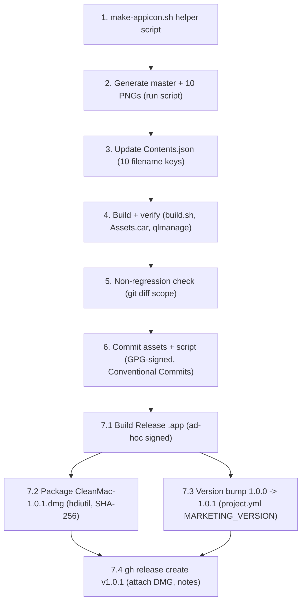

# Implementation Plan: App Icon (Broom Logo)

## Overview

This plan wires a user-provided broom JPEG into CleanMac's `AppIcon.appiconset`
using an additive, dependency-free shell pipeline (native `sips` + `hdiutil`;
`iconutil` for context only — no brew/ImageMagick/create-dmg). The pipeline
crops the 720×1024 source to a full-bleed square master (Option A: center square
with ~20px inset to shave the baked-in rounded corners so macOS is the only
thing that rounds), upscales once to a 1024×1024 master PNG, downscales-only to
ten delivered PNG sizes, wires all ten `Contents.json` slots, builds, verifies,
and confirms the change is confined to asset files plus the additive script.

Requirement 6 (repackage the v1.0.1 DMG + publish a GitHub release) has been
**explicitly requested by the user and is therefore in-scope as required tasks**
at the end of this plan.

Implementation language/tooling: **bash + native macOS CLIs** (`sips`, `plutil`,
`qlmanage`, `hdiutil`, `xcodebuild`, `xcodegen`, `gh`). No Swift changes.

## Task Dependency Graph

## Tasks

- [x] 1. Add the additive helper script `scripts/make-appicon.sh`
  - Create `scripts/make-appicon.sh` accepting an optional `<source-image>` arg defaulting to `~/Downloads/134903f2-e132-41cd-a54d-5fb03236241c.jpeg`; set `SET="CleanMac/Resources/Assets.xcassets/AppIcon.appiconset"`.
  - Add `set -euo pipefail` and a missing-source guard: `[ -f "$SRC" ] || { echo "error: source image not found: $SRC" >&2; exit 1; }` — must fire before any `sips` call so no asset is touched (R1.5).
  - Log actual source dims up front for crop tuning: `sips -g pixelWidth -g pixelHeight "$SRC"`.
  - Crop to a full-bleed square with a ~20px inset (Option A), then upscale once to the 1024 master, forcing PNG, into a `mktemp -d` scratch dir:
    - `sips -c 680 680 "$SRC" --out "$TMP/sq.png"` (center square, ~20px inset; note `-c` is height then width; tune to `640 640` if a corner sliver remains)
    - `sips -z 1024 1024 -s format png "$TMP/sq.png" --out "$TMP/master.png"`
  - Emit the 7 distinct pixel sizes into the scratch dir by downscaling from the master (never upscaling a delivered size): `for px in 16 32 64 128 256 512 1024; do sips -z "$px" "$px" "$TMP/master.png" --out "$TMP/icon_${px}.png"; done`.
  - Produce the 10 slot filenames from the 7 pixel files as byte-identical copies for shared sizes: `icon_16.png`(16), `icon_16_2x.png`(32), `icon_32.png`(32), `icon_32_2x.png`(64), `icon_128.png`(128), `icon_128_2x.png`(256), `icon_256.png`(256), `icon_256_2x.png`(512), `icon_512.png`(512), `icon_512_2x.png`(1024).
  - Write atomically: verify all 10 PNGs exist at exact sizes in `$TMP`, then move them into `$SET/`; leave `AppIcon.appiconset` untouched if any step fails.
  - Make it idempotent (re-running overwrites deterministically) and dependency-free (only `sips`, coreutils).
  - _Requirements: 1.1, 1.2, 1.3, 1.4, 1.5, 2.1, 2.2, 4.1, 4.2, 4.3_

- [x] 2. Generate the master image and the ten delivered PNGs
  - [x] 2.1 Run the script against the source: `bash scripts/make-appicon.sh` (default source path).
    - Confirm the 10 PNGs land in `CleanMac/Resources/Assets.xcassets/AppIcon.appiconset/`.
    - _Requirements: 1.1, 1.2, 1.3, 1.4, 2.1, 2.2_
  - [x]* 2.2 Verify each PNG's exact pixel dimensions
    - For each filename assert width and height via `sips -g pixelWidth -g pixelHeight <file>`: `icon_16.png`=16, `icon_16_2x.png`=32, `icon_32.png`=32, `icon_32_2x.png`=64, `icon_128.png`=128, `icon_128_2x.png`=256, `icon_256.png`=256, `icon_256_2x.png`=512, `icon_512.png`=512, `icon_512_2x.png`=1024.
    - Fail on any one-pixel deviation; eyeball `icon_16.png` / `icon_32.png` for recognizability and no upscaling artifacts.
    - _Requirements: 2.1, 4.1, 4.3, 4.4_

- [x] 3. Update `Contents.json` to reference all ten PNGs
  - Edit `CleanMac/Resources/Assets.xcassets/AppIcon.appiconset/Contents.json` adding a `filename` key to each of the ten slots per the design mapping table (16x16@1x→`icon_16.png`, 16x16@2x→`icon_16_2x.png`, 32x32@1x→`icon_32.png`, 32x32@2x→`icon_32_2x.png`, 128x128@1x→`icon_128.png`, 128x128@2x→`icon_128_2x.png`, 256x256@1x→`icon_256.png`, 256x256@2x→`icon_256_2x.png`, 512x512@1x→`icon_512.png`, 512x512@2x→`icon_512_2x.png`).
  - Preserve the existing `idiom` (`mac`), `size`, and `scale` values for all ten slots and the `info` block exactly.
  - Validate the result: `plutil -lint CleanMac/Resources/Assets.xcassets/AppIcon.appiconset/Contents.json` exits zero.
  - _Requirements: 2.3, 2.4, 2.5_

- [x] 4. Build and verify the icon renders
  - [x] 4.1 Build via `bash scripts/build.sh`
    - Confirm the build completes with no `AppIcon` asset-catalog error and XcodeGen regenerates the (gitignored) `.xcodeproj`.
    - _Requirements: 3.1, 3.4_
  - [x]* 4.2 Confirm the compiled catalog and visual fidelity
    - Assert the built `.app` contains `Contents/Resources/Assets.car` (AppIcon is compiled into it), so it resolves to the broom artwork.
    - Visual check: `qlmanage -p <path>/CleanMac.app` — broom shows clean squircle corners, no white gaps, no double-round.
    - Apply the icon-cache gotcha if a stale icon shows: `touch <path>/CleanMac.app` and/or `killall Dock` (`killall Finder`) — a cached icon is not a build failure.
    - _Requirements: 3.2, 3.3, 4.4_

- [x] 5. Non-regression scope check
  - Run `git diff --name-only` (and `git status`) and confirm changes are confined to files under `CleanMac/Resources/Assets.xcassets/AppIcon.appiconset/` plus the additive `scripts/make-appicon.sh`.
  - Confirm no Swift source file changed and (for tasks 1–6) `project.yml` is unchanged.
  - _Requirements: 5.1, 5.2, 5.3_

- [x] 6. Commit the new assets and helper script
  - Stage exactly the ten PNGs, the updated `Contents.json`, and `scripts/make-appicon.sh` (avoid `git add -A`).
  - Commit GPG-signed with a Conventional Commits message (the repo enforces the format via `.githooks/commit-msg`), e.g. `feat(icon): add broom app icon and make-appicon.sh generator`.
  - Do NOT push — per the SCM boundary, pushing requires explicit user confirmation (deferred to task 7.4 / release).
  - _Requirements: 3.1, 5.1, 5.2, 5.3_

- [x] 7. (R6 — required) Repackage and publish the v1.0.1 release
  - [x] 7.1 Build a Release-configuration app, ad-hoc signed
    - `xcodebuild -configuration Release` with `CODE_SIGN_IDENTITY="-" CODE_SIGN_STYLE=Manual ENABLE_HARDENED_RUNTIME=NO DEVELOPMENT_TEAM=""` (mirrors how the v1.0.0 DMG was built — no Developer ID).
    - Confirm the Release `.app` shows the new broom icon and bundles the rule YAMLs from `CleanMac/Resources/Rules/`.
    - _Requirements: 6.1_
  - [x] 7.2 Package the DMG with `hdiutil`
    - Build a staging folder containing `CleanMac.app` and an `/Applications` symlink, then `hdiutil create ... -format UDZO CleanMac-1.0.1.dmg`.
    - Compute and record `shasum -a 256 CleanMac-1.0.1.dmg`.
    - _Requirements: 6.1_
  - [x] 7.3 Bump version 1.0.0 → 1.0.1
    - Change `MARKETING_VERSION` in `project.yml` from `1.0.0` to `1.0.1`. **This IS a `project.yml` change** — it is a documented, in-scope version bump for R6, explicitly exempt from R5.3 (which forbade project.yml *icon-asset* changes); it is NOT a regression. Flag it in the commit message.
    - Regenerate the project (`xcodegen` / `bash scripts/build.sh`) and rebuild so the DMG's app reports version 1.0.1.
    - _Requirements: 6.1_
  - [x] 7.4 Publish the GitHub release v1.0.1
    - `gh release create v1.0.1 --target main` attaching `CleanMac-1.0.1.dmg`, with notes covering: the new broom icon, the same Gatekeeper / Full Disk Access caveats as v1.0.0, and the DMG SHA-256.
    - **Requires explicit user confirmation before pushing the tag/commit and publishing** — per the SCM boundary, the agent prepares the release but does not push/publish without a fresh in-session "yes".
    - _Requirements: 6.2_

## Notes

- Tasks marked with `*` are optional verification sub-tasks and can be skipped for a faster path, but they back the design's exact-dimension and visual-fidelity acceptance criteria — recommended to keep.
- Every task references specific requirement clauses for traceability.
- No property-based tests: the design has no "Correctness Properties" section (this is asset/build-wiring work), so verification uses exact-dimension assertions, JSON-lint, a build/integration check, and a manual visual check.
- SCM boundary: commits are local until task 7.4; pushing/publishing needs explicit user confirmation.
- Version-bump exception: task 7.3's `project.yml` `MARKETING_VERSION` change is a deliberate, documented R6 exception to R5.3 and must not be flagged as a non-regression violation.
