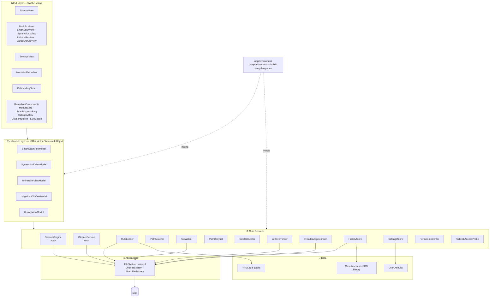
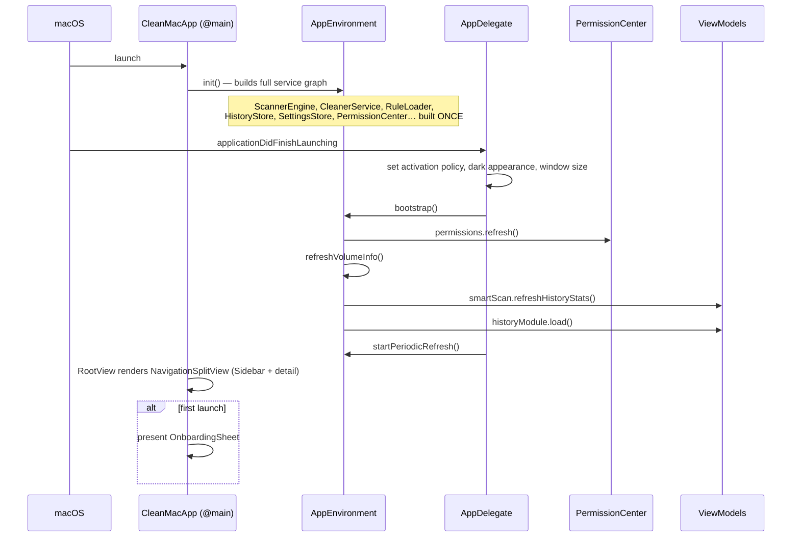
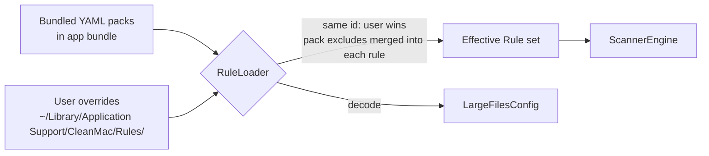
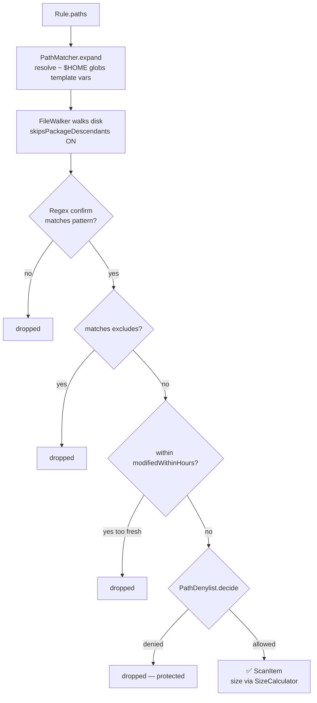
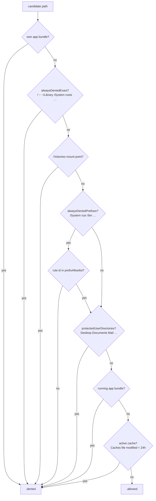
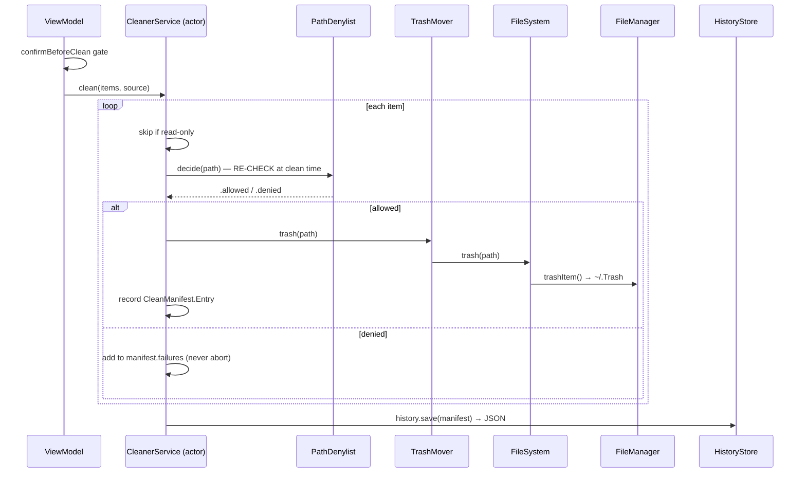

# CleanMac — Codebase Guide (How Everything Works)

CleanMac is a native macOS 14+ SwiftUI utility — a CleanMyMac‑style cleaner — organized around **4 modules**: Smart Scan, System Junk, Uninstaller, and Large & Old Files. Its design rests on four pillars: it is **rule‑driven** (what counts as "junk" is declared in YAML, not guessed in code), it is **trash‑first** (files are moved to the Trash, never permanently deleted), it enforces a **safety denylist** (a hard list of paths the app refuses to touch), and it ships with **no third‑party dependencies** (pure Swift + Apple frameworks). This guide is the friendly, diagram‑rich companion to [`ARCHITECTURE.md`](./ARCHITECTURE.md); read this to build a mental model, then read that for the formal architecture notes.

> ⚠️ **Reference implementation.** All code described here is a reference implementation. It needs an AppSec review before any production use — treat the safety mechanisms as a starting point, not a certification.

---

## Table of Contents

1. [Big Picture / Layered Architecture](#1-big-picture--layered-architecture)
2. [Folder / File Map](#2-folder--file-map)
3. [App Startup / Composition Root](#3-app-startup--composition-root)
4. [The Rule System (how "junk" is defined)](#4-the-rule-system-how-junk-is-defined)
5. [Scan Pipeline (ScannerEngine)](#5-scan-pipeline-scannerengine)
6. [The Safety Denylist (PathDenylist)](#6-the-safety-denylist-pathdenylist)
7. [Clean / Delete Pipeline (trash-first)](#7-clean--delete-pipeline-trash-first)
8. [Undo / History (HistoryStore + HistoryViewModel)](#8-undo--history-historystore--historyviewmodel)
9. [The FileSystem Abstraction & Testing](#9-the-filesystem-abstraction--testing)
10. [The Four Modules (quick tour)](#10-the-four-modules-quick-tour)
11. [Permissions & Onboarding](#11-permissions--onboarding)
12. [Cross-cutting: Theme, Localization, Concurrency](#12-cross-cutting-theme-localization-concurrency)
13. [How to Build, Run, Test (recap)](#13-how-to-build-run-test-recap)
14. [Glossary](#14-glossary)

---

## 1. Big Picture / Layered Architecture

CleanMac is layered top‑to‑bottom: **SwiftUI Views** render state and forward user intent to **ViewModels**; ViewModels orchestrate **Core services**; every service that touches the disk goes through the **`FileSystem` protocol** rather than calling `FileManager` directly; and the actual **data** lives as YAML rule packs, JSON history manifests, and `UserDefaults`.

The single object that wires all of this together is **`AppEnvironment`** — the *composition root*. It builds every service exactly once at launch and injects them downward, so nothing constructs its own dependencies ad hoc.



**Read the diagram as a one‑way flow:** user input enters at the top, decisions ripple down through ViewModels into services, and only the abstraction layer is allowed to talk to the disk. `AppEnvironment` sits to the side because it is not part of the runtime flow — it is the wiring harness that hands each layer its collaborators at startup.

---

## 2. Folder / File Map

All source lives under `CleanMac/`. Each folder has a single job:

```text
CleanMac/
├── App/                      # @main entry point + composition root + AppDelegate
├── Core/                     # framework-agnostic engine (no SwiftUI here)
│   ├── Scanner/              # ScannerEngine, FileWalker, PathMatcher, ScanItem, ScanProgress
│   ├── Rules/                # Rule, RuleLoader, RulePack, YAMLParser
│   ├── Cleaner/              # CleanerService, TrashMover, CleanManifest
│   ├── Permissions/          # PermissionCenter, FullDiskAccessProbe
│   ├── FileSystem/           # FileSystem protocol, LiveFileSystem, SizeCalculator, AppBundleInfo
│   ├── Safety/               # PathDenylist (the hard veto list)
│   ├── Persistence/          # HistoryStore, SettingsStore
│   └── Localization/         # L10n facade
├── Modules/                  # one folder per feature = ViewModel (+ some views)
│   ├── SmartScan/            # SmartScanViewModel, SmartScanView
│   ├── SystemJunk/           # SystemJunkViewModel, SystemJunkView
│   ├── Uninstaller/          # UninstallerViewModel, UninstallerView, InstalledAppScanner, LeftoverFinder
│   ├── LargeAndOld/          # LargeAndOldViewModel, LargeAndOldView
│   └── History/              # HistoryViewModel
├── UI/                       # cross-module SwiftUI
│   ├── Theme/                # Theme.swift — palette, gradients, typography
│   ├── Components/           # reusable views: ModuleCard, ScanProgressRing, CategoryRow, GradientButton, SizeBadge
│   ├── Sidebar/              # SidebarView (navigation)
│   ├── Settings/             # SettingsView
│   ├── MenuBar/              # MenuBarExtraView
│   └── History/              # history screens
├── Resources/
│   ├── Assets.xcassets/      # AccentColor, AppIcon
│   ├── Rules/                # ⭐ system-junk.yaml, uninstaller-leftovers.yaml, large-files-defaults.yaml
│   └── Localizable.xcstrings # string catalog (generated)
└── Supporting/
    ├── Info.plist            # bundle metadata
    └── CleanMac.entitlements # entitlements (app-sandbox = false)
```

A few things that live outside `CleanMac/`:

- **`CleanMacTests/`** — the XCTest suite (**231 tests**) plus `MockFileSystem`, the in‑memory `FileSystem` used to test the engine without touching a real disk.
- **`project.yml`** — the [XcodeGen](https://github.com/yonaskolb/XcodeGen) spec. The `.xcodeproj` is **generated** from it and is gitignored, so you never edit the project file by hand.
- **Build** with `bash scripts/build.sh`; **test** with `bash scripts/build.sh --test`.

---

## 3. App Startup / Composition Root

The entry point is `@main struct CleanMacApp: App`. It owns a single `@StateObject var environment = AppEnvironment()`. `AppEnvironment.init` is where the entire service graph is constructed once and then injected into everything downstream — this is the *composition root*.

App lifecycle events (activation policy, forcing the dark appearance, window sizing) are handled by `AppDelegate`, wired in via `NSApplicationDelegateAdaptor`. When the app finishes launching, the delegate calls `environment.bootstrap()` and `environment.startPeriodicRefresh()`.

The UI shell is `RootView`, a `NavigationSplitView` with a fixed **220pt** `SidebarView` on the left and the selected module as the detail view. On first launch (when `!hasCompletedOnboarding`), it presents the `OnboardingSheet`.



---

## 4. The Rule System (how "junk" is defined)

This is the heart of CleanMac. **Junk is never guessed by the code.** It is *declared* in YAML rule packs under `CleanMac/Resources/Rules/`:

| Pack file | Purpose |
| --- | --- |
| `system-junk.yaml` | Caches, logs, developer artifacts, language files, trash, mail, backups. |
| `uninstaller-leftovers.yaml` | Where an app leaves files behind after you drag it to the Trash. |
| `large-files-defaults.yaml` | Default size/age thresholds for the Large & Old module (`LargeFilesConfig`). |

### Anatomy of a `Rule`

Defined in `CleanMac/Core/Rules/Rule.swift`, a rule describes **what** to match; the engine decides **how**:

| Field | Meaning |
| --- | --- |
| `id` | Unique key. A user rule with the same id **overrides** the bundled one. |
| `name` | Human‑readable label shown in the UI. |
| `category` | `RuleCategory` — grouping bucket (caches, logs, developer, …). |
| `safety` | `SafetyLevel` — `safe` \| `review` \| `dangerous`. |
| `paths` | Glob patterns to match. |
| `excludes` | Glob patterns; any match here wins over `paths`. |
| `strategy` | Optional `RuleStrategy` for logic a glob can't express. |
| `modifiedWithinHours` | Skip files whose mtime is within this many hours (protects fresh files). |
| `keepLanguages` | For `languageFilter`: languages to never remove (defaults to `[active]`). |
| `description` | Tooltip help text. |

### `SafetyLevel` drives the UI

| Level | UI behavior |
| --- | --- |
| `safe` | **Pre‑checked** — the app is confident this is disposable. |
| `review` | **Unchecked** + warning badge — the user should read the description first. |
| `dangerous` | **Hidden** unless the user enables "Show advanced rules" in Settings. |

### `RuleStrategy` — the specialized handlers

Some cleanup logic can't be written as a glob, so a rule can name a strategy handler instead:

| Strategy | What it does |
| --- | --- |
| `languageFilter` | Keeps `.lproj` bundles for the user's active languages, removes the rest. |
| `trashBins` | Enumerates the `.Trashes` folder on every mounted volume. |
| `brokenLoginItems` | Finds login items whose target application no longer exists. |
| `tmutilSnapshots` | Reports APFS local Time Machine snapshots (read‑only, managed by `tmutil`). |

### A real rule, end to end

Here is the actual `user-caches` rule from `system-junk.yaml`. It matches everything one level under `~/Library/Caches`, but *excludes* Safari/App Store/TCC/CloudKit/bird caches, skips anything touched in the last 24 hours, and is marked `safe` (so it's pre‑checked):

```yaml
- id: user-caches
  name: User Cache Files
  category: caches
  safety: safe
  paths:
    - "~/Library/Caches/*"
  excludes:
    - "~/Library/Caches/com.apple.Safari/**"
    - "~/Library/Caches/com.apple.appstore/**"
    - "~/Library/Caches/com.apple.AppStore/**"
    - "~/Library/Caches/com.apple.TCC/**"
    - "~/Library/Caches/CloudKit/**"
    - "~/Library/Caches/com.apple.bird/**"
  modifiedWithinHours: 24
  description: Temporary files that apps recreate automatically.
```

### How rules are loaded (`RuleLoader`)

`RuleLoader` builds the effective rule set in two passes:

1. **Bundled packs** — it looks up each pack inside the app bundle, first trying the `Rules/<name>.yaml` subdirectory, then falling back to a flat lookup.
2. **User overrides** — it merges any packs found in `~/Library/Application Support/CleanMac/Rules/`. If a user rule shares an `id` with a bundled rule, **the user wins**. Pack‑level `excludes` are merged into *every* rule in that pack.

`RuleLoader` also decodes `LargeFilesConfig` from `large-files-defaults.yaml` for the Large & Old module.



The [scan decision funnel](#5-scan-pipeline-scannerengine) in the next section shows how a single rule becomes zero or more `ScanItem`s.

---

## 5. Scan Pipeline (ScannerEngine)

`ScannerEngine` is a Swift **`actor`** — it serializes access to its own state so concurrent scans are safe. Its entry point is:

```swift
scan(rules:context:runningAppBundlePaths:concurrency:progress:onProgress:)
```

It runs rules **in parallel** using a bounded `TaskGroup` (concurrency ≈ `activeProcessorCount / 2`, so a scan uses about half the cores). For each rule, `evaluate` either dispatches to a specialized strategy handler (see the `RuleStrategy` table above) or performs the **default glob match**:

1. **`PathMatcher.expand`** turns a glob into concrete search roots, resolving `~`, `$HOME`, template vars like `{bundleId}` / `{appName}`, and the wildcards `*`, `**`, `?`.
2. **`collectMatches`** walks the disk via `FileWalker`, then compiles the pattern to a **regex** to confirm each candidate actually matches.
3. **Excludes** are applied — any `excludes` match drops the candidate.
4. **`modifiedWithinHours`** filters out files that are too fresh.
5. **Metadata** is read via `FileSystem.metadata`.
6. **`PathDenylist.decide`** gets the final say — a denied path is skipped.
7. **Size** is computed (`SizeCalculator` recurses for directories).
8. A **`ScanItem`** is produced (or the candidate is dropped).

`FileWalker` uses a `FileManager` enumerator with **`skipsPackageDescendants` ON**, so a `.app` bundle counts as a *single* item instead of thousands of nested files. It requests the resource keys it needs up front and honors **cooperative cancellation** via `Task.checkCancellation`. Progress is emitted on an `AsyncStream<ScanProgress>` so the UI can show live counters as the scan runs.



> 🛡️ **Why order matters:** the denylist runs **after** matching. Even if a badly written rule tries to match `/System` or `~/Documents`, the item is vetoed at step 6 before it can ever reach a protected path.

---

## 6. The Safety Denylist (PathDenylist)

`PathDenylist` is the **last line of defense**. It runs on every candidate **at scan time** and again **at clean time** (the filesystem may have changed in between). Its core method, `decide(...)`, returns either `.allowed` or `.denied(reason)`.

It refuses, among others:

| Category | Examples |
| --- | --- |
| **Own bundle** | CleanMac's own app bundle (can't clean itself). |
| **`alwaysDeniedExact`** | `/`, home root, `~/Library`, `/Library`, `/private`, `/var`, `/tmp`, `/Volumes`, `/Applications`. |
| **`/Volumes` mount points** | The mount points themselves (not just the root). |
| **`alwaysDeniedPrefixes`** | `/System`, `/usr`, `/bin`, `/sbin`, `/var/db`, `/Library/Apple`, `/Applications/Utilities`, … — unless the rule's `id` is in a small **`prefixAllowlist`**. |
| **`protectedUserDirectories`** | `~/Desktop`, `~/Documents`, `~/Downloads`, `~/Movies`, `~/Music`, `~/Pictures`, plus Keychains, Mail, Messages, iCloud. |
| **Running app bundles** | Anything currently running, from the `NSWorkspace` snapshot. |
| **Active caches** | Any file inside a `Caches` folder modified within `activeCacheWindowHours = 24`. **This cannot be opted out.** |



---

## 7. Clean / Delete Pipeline (trash-first)

> 🗑️ **Nothing is ever permanently deleted.** CleanMac moves files to the Trash — exactly what Finder does with ⌘‑Delete — so any mistake is recoverable.

`CleanerService` is an **`actor`**. `clean(items:source:...)` loops over the selected items and, for each one:

1. **Skips** read‑only items (e.g. `tmutilSnapshots`).
2. **Re‑checks `PathDenylist`** at clean time — the world may have changed since the scan.
3. Calls **`TrashMover.trash(path)`**, which calls **`FileSystem.trash`**, which calls **`FileManager.trashItem`** (moves the item to `~/.Trash`, identical to Finder).
4. Records a **`CleanManifest.Entry`** — `originalPath`, `trashPath`, `size`, `ruleID`, …

Failures are collected into `manifest.failures` and **never abort** the run — one file it can't touch won't stop the rest. When finished, the service writes the `CleanManifest` as **JSON** into `~/Library/Application Support/CleanMac/History/`.

`TrashMover` normalizes the path, checks existence, and retries once on a transient IO error. There *is* a permanent `removeItem` in `FileSystem`, but it is used **only** by `HistoryStore` to prune old manifest JSON files — **never on user files.**

In the ViewModel, a `confirmBeforeClean` gate can require an explicit confirmation before the clean runs.



---

## 8. Undo / History (HistoryStore + HistoryViewModel)

Because every clean writes a `CleanManifest` (one JSON file per operation), CleanMac can **undo** any clean. `HistoryViewModel` lists past operations, supports search, and exposes `restore(manifest)`.

`restore` calls `CleanerService.restore`, which moves each entry from its `trashPath` back to its `originalPath` via `FileSystem.restore` (`FileManager.moveItem`). It recreates parent directories if needed, and if the original path is now taken, it appends `" 2"`, `" 3"`, … so it **never overwrites** existing files. A successful full restore deletes that manifest from history and subtracts the reclaimed bytes from the running total.

```mermaid
sequenceDiagram
    participant HVM as HistoryViewModel
    participant Cleaner as CleanerService
    participant FS as FileSystem
    participant Hist as HistoryStore

    HVM->>Cleaner: restore(manifest)
    loop each entry
        Cleaner->>FS: restore(trashPath → originalPath)
        Note over FS: recreate parent dirs;<br/>append " 2"/" 3" if taken — never overwrite
    end
    alt full restore succeeded
        Cleaner->>Hist: delete manifest, subtract reclaimed bytes
    end
    Cleaner-->>HVM: result
```

---

## 9. The FileSystem Abstraction & Testing

Every disk operation goes through the **`FileSystem` protocol** (`exists`, `metadata`, `contentsOfDirectory`, `enumerate`, `trash`, `restore`, `removeItem`, `volumeInfo`, …). There are two implementations:

- **`LiveFileSystem`** — wraps the real `FileManager`. Used in the shipping app.
- **`MockFileSystem`** — an in‑memory dictionary of paths. Used in tests.

This indirection is what makes the scanner, cleaner, and leftover finder **fully unit‑testable without touching the real disk** — a test hands the engine a `MockFileSystem` populated with fake files and asserts on the resulting `ScanItem`s. All **231 XCTest tests** pass this way.

> 📝 **Documented gotcha:** `HistoryViewModel.revealStorageDirectory` deliberately uses `FileManager` directly instead of the injected `FileSystem`. That's intentional — its result is handed to `NSWorkspace`, which only acts on the *real* volume, so a mock path would be meaningless there.

---

## 10. The Four Modules (quick tour)

Each module is a `@MainActor ObservableObject` ViewModel paired with a SwiftUI view, backed by a rule pack or strategy.

### System Junk
`SystemJunkViewModel` + `SystemJunkView`. Loads the **`system-junk`** pack, groups matches by `RuleCategory`, pre‑checks `safe` rules and leaves `review` rules unchecked. Cleaning goes through `CleanerService` (trash‑first).

### Large & Old Files
`LargeAndOldViewModel` + `LargeAndOldView`. The user picks folders; results are filtered by **size and age** using `LargeFilesConfig` (loaded from `large-files-defaults.yaml`). Supports Quick Look preview and, of course, trash‑first delete.

### Uninstaller
`UninstallerViewModel` + `UninstallerView`. `InstalledAppScanner` enumerates `/Applications` and friends; `AppBundleInfo` reads each app's `Info.plist` (to get its `bundleId`). `LeftoverFinder` uses **`uninstaller-leftovers.yaml`** with the `{bundleId}` / `{appName}` template variables to locate leftover support files, containers, preferences, and launch agents. A running app is **quit before** it's uninstalled.

### Smart Scan
`SmartScanViewModel` + `SmartScanView`. The aggregator — it runs junk, large files, and orphaned leftovers **concurrently** (`async let`), shows an animated progress ring, and cleans the `safe` items in one pass.

---

## 11. Permissions & Onboarding

To reach system caches and other apps' containers, CleanMac needs **Full Disk Access (FDA)**. `FullDiskAccessProbe.isGranted()` detects it pragmatically: it attempts to read `~/Library/Application Support/com.apple.TCC/TCC.db`; an `EPERM` error means access is **not** granted.

`PermissionCenter` is an observable object that exposes the current permission state and deep‑links the user straight to the relevant System Settings pane. The `OnboardingSheet` runs on first launch and **polls** until FDA is granted.

> 🔓 The app is **not sandboxed** — `CleanMac.entitlements` sets `app-sandbox` to `false` — precisely because it must clean system caches and other apps' containers, which a sandbox would forbid. It is instead distributed via **Developer ID + notarization** (see [`notarization.md`](./notarization.md)).

---

## 12. Cross-cutting: Theme, Localization, Concurrency

**Theme.** `Theme.swift` defines the dark palette, gradients, and typography used across every view.

**Localization.** The `L10n` facade wraps the `Localizable.xcstrings` string catalog (which is generated). `LocalizationTests` assert parity so no string is left untranslated.

**Concurrency.** The model is deliberate:

- ViewModels are `@MainActor ObservableObject` — safe to bind directly to SwiftUI.
- `ScannerEngine` and `CleanerService` are **actors** — heavy work runs off the main actor.
- Progress hops back to the UI via `Task { @MainActor in … }`.
- `SettingsStore` defers its `objectWillChange` onto `RunLoop.main`, so it never fires *during* a SwiftUI view‑update pass (which would trigger the "Publishing changes from within view updates" warning).

---

## 13. How to Build, Run, Test (recap)

```bash
brew install xcodegen                 # one-time: generates the .xcodeproj from project.yml
bash scripts/build.sh --doctor        # check code-signing setup
bash scripts/build.sh                 # build
bash scripts/build.sh --open          # open in Xcode
bash scripts/build.sh --test          # run the 231 XCTest tests
bash scripts/notarize.sh              # build + sign + notarize for distribution
```

The `.xcodeproj` is **generated** from `project.yml` (and gitignored) — never edit it directly; change `project.yml` and regenerate.

---

## 14. Glossary

| Term | Meaning |
| --- | --- |
| **Rule** | A single YAML‑declared unit of cleaning logic — what to match, how safe it is. |
| **RulePack** | A YAML file grouping related rules (e.g. `system-junk.yaml`). |
| **ScanItem** | One concrete match produced by the scanner — a path, size, and metadata ready to show or clean. |
| **CleanManifest** | The JSON record of one clean operation — every file moved, where it went, its size — the basis for undo. |
| **denylist** | `PathDenylist` — the hard veto list of paths the app refuses to touch, checked at scan and clean time. |
| **strategy** | A named `RuleStrategy` handler for logic a glob can't express (e.g. `languageFilter`). |
| **trash‑first** | The policy of moving files to `~/.Trash` (never permanently deleting) so mistakes are recoverable. |
| **composition root** | `AppEnvironment` — the single place that builds the whole service graph once and injects it. |
| **actor** | A Swift concurrency type that serializes access to its state; used for `ScannerEngine` and `CleanerService`. |
| **ObservableObject** | A SwiftUI type whose changes automatically refresh bound views; used for every ViewModel. |
